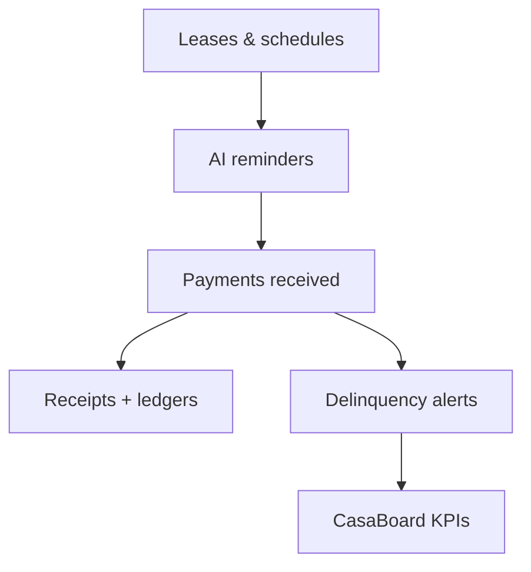

## What it does

- Tracks rent schedules by property, unit, and lease.
- Sends proactive reminders, receipts, and escalation notices.
- Flags delinquencies and anomalies for follow-up.

## Why it matters

- Reduce late payments with timely nudges.
- Standardize communication and receipts.
- Keep finance and operations aligned with live status.

## How it works

<Steps>
<Step title="Sync schedules">
  Import leases, rent amounts, and due dates from CSV, API, or PMS exports.
</Step>
<Step title="Automate reminders">
  AI drafts reminders and escalations (email/SMS) based on due dates, grace periods, and delinquency rules.
</Step>
<Step title="Track and reconcile">
  Reconcile payments, issue receipts, and push ledger updates to accounting systems or webhooks.
</Step>
</Steps>

## Configuration checklist

- Required fields: tenant_id, unit_id, due_date, amount, currency, status.
- Notification windows: pre-due, due, grace, escalation.
- Channels: email, SMS, or webhook to your comms system.

## Example automation

<RequestExample>
```json Payment event
{
  "tenant_id": "tenant_22",
  "unit_id": "unit_5B",
  "due_date": "2025-02-01",
  "amount": 2450,
  "currency": "USD",
  "status": "due"
}
```
</RequestExample>

<ResponseExample>
```json Reminder sent
{
  "tenant_id": "tenant_22",
  "status": "reminder_sent",
  "channel": "email",
  "template": "pre-due",
  "next_action": "awaiting_payment"
}
```
</ResponseExample>

## Metrics to watch

- On-time payment rate by property/unit.
- Average days outstanding.
- Number of escalations per period.

## Diagram



