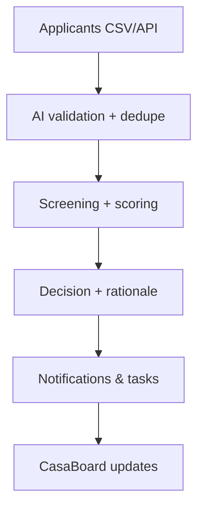

## What it does

- Capture applications from forms, CSV imports, or APIs.
- Verify identity, income, and documents automatically.
- Generate screening summaries and recommendations with audit trails.

## Why it matters

- Reduce manual back-and-forth with applicants.
- Standardize screening to lower risk and bias.
- Shorten decision cycles with clear, repeatable steps.

## How it works

<Steps>
<Step title="Ingest applicants">
  Accept leads from forms, CRM, CSV uploads, or `/api/v1/tenants`. Normalize names, IDs, units, and contact info.
</Step>
<Step title="Verify & score">
  AI validates IDs and income proofs, checks completeness, and assigns a screening score with rationale.
</Step>
<Step title="Decide & notify">
  Generate approval/conditional/decline summaries, send next steps, and create tasks in your CRM or ticketing system.
</Step>
</Steps>

## Configuration checklist

- Map required fields: applicant name, contact, unit, move-in date, income docs, ID docs.
- Choose a screening template (credit, income multiple, rental history).
- Define routing: approver, SLAs, notifications, and webhook targets.

## Example workflow

<RequestExample>
```json Applicant payload
{
  "tenant_id": "app_78431",
  "unit_id": "unit_12A",
  "income_docs": ["https://files.casaai.dev/documents/paystub.pdf"],
  "id_doc": "https://files.casaai.dev/documents/id-front.png",
  "credit_consent": true
}
```
</RequestExample>

<ResponseExample>
```json Screening summary
{
  "tenant_id": "app_78431",
  "status": "approved",
  "score": 86,
  "rationale": [
    "Income multiple 3.2x threshold",
    "Credit signals clean",
    "No open maintenance debt"
  ],
  "next_steps": ["Send lease packet", "Collect deposit"]
}
```
</ResponseExample>

## Diagram



