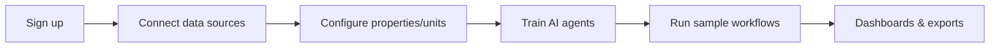

## Overview

Follow these steps to get CasaAI running with your data and workflows. Each step includes verification so you know you are ready to proceed.

<Note>
Docs URL: <a href="https://docs.casaai.dev">https://docs.casaai.dev</a>. Main site: <a href="https://casaai.dev">https://casaai.dev</a>.
</Note>

## Steps

<Steps>
<Step title="Sign up or sign in">
  - Go to [casaai.dev](https://casaai.dev) and choose email or OAuth.
  - Complete MFA if prompted.
  <Check>Landing on CasaBoard home screen.</Check>
</Step>

<Step title="Connect data sources">
  - Upload PMS CSVs or spreadsheets (tenants, units, payments, maintenance).
  - Connect cloud storage (Drive/S3) for leases and tickets with photos.
  - Optional: connect via API for continuous sync.
  <Check>Data import shows green status; entities created for properties, units, tenants.</Check>
</Step>

<Step title="Configure properties and units">
  - Map CSV columns to CasaAI fields.
  - Confirm units belong to properties; assign rent schedules and lease terms.
  <Check>No unmapped units or tenants remain.</Check>
</Step>

<Step title="Train AI agents">
  - Choose templates: Tenant Screening, Maintenance Triage, Rent Reminders, Finance KPIs.
  - Upload historical examples; label desired outcomes and routing rules.
  - Name each workflow and assign owners.
  <Check>Agent status: Ready. Test run succeeds.</Check>
</Step>

<Step title="Run sample workflows">
  - Tenant screening: submit a new applicant record.
  - Maintenance: create a ticket with description and photo.
  - Rent reminders: simulate a delinquent payment event.
  <Check>Actions logged with decisions and notifications visible.</Check>
</Step>

<Step title="Review dashboards and exports">
  - Open CasaBoard to view KPIs (occupancy, delinquency, SLAs, NOI).
  - Export dashboards to CSV/Excel or send to BI via webhook.
  <Check>Export/download succeeds and file/webhook arrives.</Check>
</Step>
</Steps>

## Example block diagram

## Example screens (placeholders)

<Columns cols={3}>
  <Frame caption="Data source connection status">
    
  </Frame>
  <Frame caption="Agent training readiness">
    
  </Frame>
  <Frame caption="CasaBoard KPIs">
    
  </Frame>
</Columns>

## Tips

- Start with one property and one workflow to validate mappings.
- Keep a small labeled dataset for agent training, then expand.
- Use webhooks for downstream systems (ticketing, CRM, BI) to keep data in sync.

